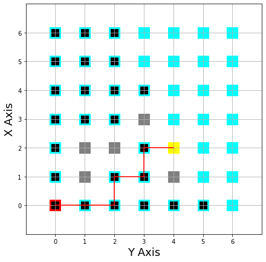

This repo contains the code for a UCS using a graph approach on a 2D matrix simulation a robot finding its path in a maze.

The starting tile is painted in red and the end tile yellow.

The black tiles represent explored nodes (closed set)

